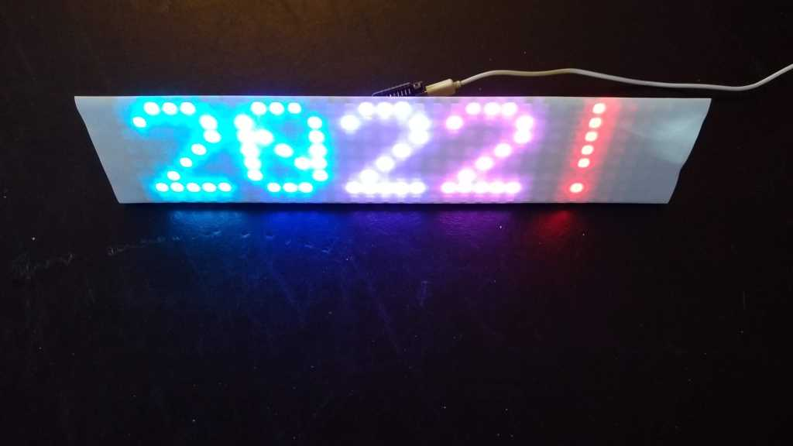
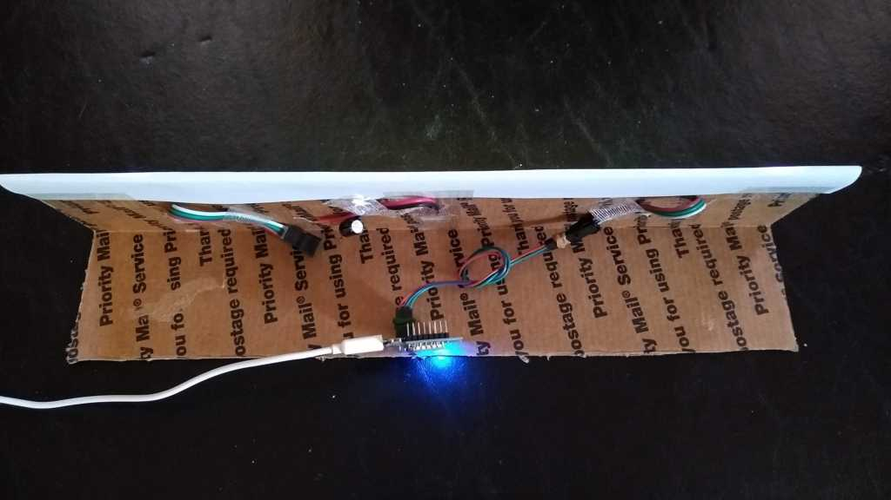

**ESP8266 8x32 Matrix - Happy New Year**

Fun implementation of Aaron Liddiment's LEDText library with New Year 2022 greeting.

All credit to:
https://github.com/AaronLiddiment/LEDText. Really nice work.

A 8x32 WS2812B ("NeoPixel") panel from AliExpress is only $12. Throw in a Wemos D1 mini ESP8266, some cardboard, a few jumpers, a capacitor (probably not needed), a sheet of 8.5x14 paper, and code from GitHub and voila! You have a fun New Years display.

***Front:***

***Back:***

***Video:***

